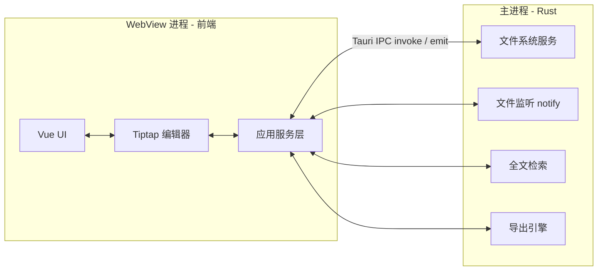
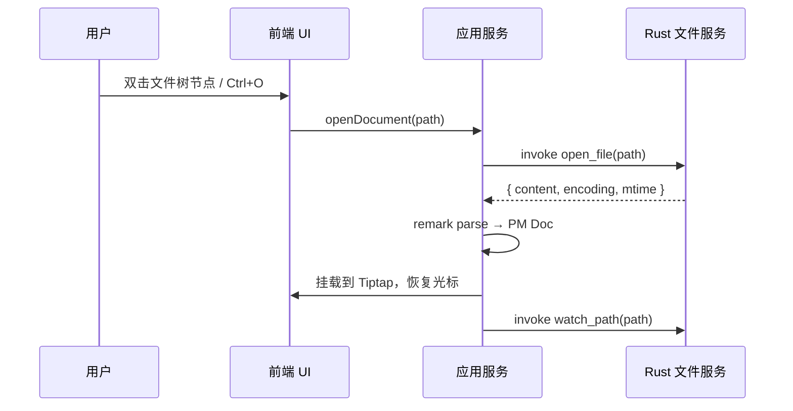
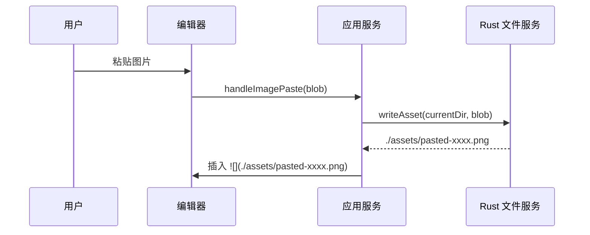

# 极简 Markdown 所见即所得编辑器 — 设计文档

> 项目代号：**Mira**\
> 文档版本：v1.1 ｜ 日期：2026-06-29（定名 Mira · 开源 MIT · 源码模式纳入 · 导出延后至 M5）\
> 定位：桌面端 · 本地优先 · 单用户 · 所见即所得（对标 Typora）
>

---

## 1. 概述

### 1.1 背景

Markdown 已成为技术写作、笔记、文档的事实标准。市面工具大致两类：

  - **源码派**：分栏（左源码 / 右预览），如 VS Code、Obsidian 默认模式、Typora 之外的大多数。写作时心智在"语法"和"排版"间来回切换。
  - **所见即所得派**：以 Typora 为代表，输入即渲染，无预览分栏，沉浸感强。

本产品选择后者，目标是做一个**轻量、本地优先、界面干净**的桌面 Markdown 编辑器。

### 1.2 目标（Goals）

  - 真正的所见即所得（Live WYSIWYG）：打字即渲染，**无分栏预览**。
  - 本地优先：直接读写磁盘上的 `.md` 文件，**不锁定格式、不引入私有数据库**，文件随时可用其他工具打开。
  - 轻量：安装包小、内存占用低、启动快。
  - 跨平台：Windows / macOS / Linux 三端。

### 1.3 非目标（Non-Goals）

  - ❌ 云端账号、实时多人协作（本期不做，预留架构但不实现）。
  - ❌ 双向链接 / 关系图谱 / 知识库管理（那是 Obsidian 类产品的方向，与"极简"定位冲突）。
  - ❌ 富文本块编辑（Block-based，如 Notion）。本产品坚持 Markdown 文本语义。
  - ❌ 移动端（本期不做）。

### 1.4 对标分析

| 产品 | 壳 | 编辑内核 | 优点 | 痛点 / 差异化机会 |
| --- | --- | --- | --- | --- |
| **Typora** | Electron | 自研 | WYSIWYG 体验标杆、付费 | 闭源付费；图片/导出配置略繁琐 |
| **MarkText** | Electron | 自研（Muya） | 开源、免费 | 维护停滞、偶发渲染 bug |
| **Obsidian** | Electron | 自研 | 插件生态强 | 默认非 WYSIWYG、偏知识库、重 |
| **Zettlr** | Electron | CodeMirror | 学术写作友好 | 非纯 WYSIWYG |

**差异化定位**：开源、Tauri 轻量壳、现代 WYSIWYG 内核（Tiptap）、原生级的文件系统集成。不做大而全，把"打开即写、文件就是我的"这两件事做到极致。

---

## 2. 设计原则

  1. **文件即真相（File is the source of truth）**\
内存中的编辑态只是磁盘文件的临时副本；任何时刻崩溃都不应丢数据（见 §10.2 自动保存与崩溃恢复）。
  2. **Markdown 优先，富文本其次**\
内部数据模型始终可无损序列化回标准 Markdown，避免"在 Typora 里写的拿到别处打不开"。
  3. **零配置可用，进阶可调**\
开箱即用一套合理默认；主题、快捷键、CSS 留给高级用户自定义。
  4. **性能优先于功能堆砌**\
极简定位下，宁可砍功能也不牺牲启动速度与打字延迟。

---

## 3. 技术选型

### 3.1 选型总览

| 层 | 选型 | 备选 | 理由 |
| --- | --- | --- | --- |
| 应用壳 | **Tauri 2** | Electron | 安装包 ~5–15MB（Electron ~80MB+），内存占用低；Rust 后端原生访问文件系统、文件监听。 |
| 语言 | 前端 **TypeScript**，后端 **Rust** | — | 类型安全 + 原生性能。 |
| 构建 | **Vite** | webpack | 冷启动快，HMR 体验好，与 Tauri 集成成熟。 |
| UI 框架 | **Vue 3 + **`<script setup>` | React | 运行时小、SFC 组织清晰；Tiptap 有一等公民的 Vue 绑定（`@tiptap/vue-3`）。React 可 1:1 平替。 |
| 编辑内核 | **Tiptap v2**（基于 ProseMirror） | Milkdown / Lexical / 自研 | 无头（headless）、扩展性强、WYSIWYG 友好；`tiptap-markdown` 可做 Markdown 双向序列化。 |
| 源码模式 | **CodeMirror 6** | Monaco | 确定功能：切换纯 Markdown 源码编辑；兼作大文件退化路径（见 §20.1）。 |
| Markdown 解析 | **remark / unified** 生态 | markdown-it | AST 成熟、插件丰富（GFM、数学、脚注），用于导入/导出与一致性校验。 |
| 文件监听 | Rust `notify` crate | chokidar（JS） | 跨平台原生 FS 事件，开销低。 |
| 持久化 | `.md` 文件 + JSON 配置 | SQLite | 本地单用户无需数据库；全文检索索引可选 SQLite（见 §11.1）。 |
| 样式 | CSS Variables + SCSS | — | 主题热切换；支持用户自定义 CSS。 |

### 3.2 为什么是 Tauri 而不是 Electron

Typora / Obsidian / MarkText 都用 Electron，说明 Electron 在"嵌入复杂 Web 编辑器"这件事上最稳。但 Tauri 2 已足够成熟，且在**安装体积、内存、启动速度**上有数量级优势——这与"极简"定位强一致。

**风险与兜底**：Tauri 依赖系统 WebView（Win=WebView2，mac=WebKit，Linux=WebKitGTK），三端渲染可能存在细微差异。若后期遇到难以调和的 WebView 兼容问题，可切回 Electron，前端代码 95% 可复用（这是选择"无头编辑内核 + 框架无关"的额外收益）。

### 3.3 为什么编辑内核选 Tiptap

  - **无头**：不绑定 UI，可完全自绘 Typora 风格界面。
  - **基于 ProseMirror**：schema 严格、协作友好（未来若做协作可平滑迁移）。
  - **扩展生态**：表格、任务列表、代码块、数学公式、高亮等均有现成扩展。
  - **Markdown 双向序列化**：通过 `tiptap-markdown` + 自定义序列化器，保证内容能无损导回标准 `.md`。

> 若对 Markdown 语义纯洁度要求极高，可改用 **Milkdown**（同为 ProseMirror，插件驱动，更"Markdown 原生"）。两者迁移成本中等。
>

---

## 4. 系统架构

### 4.1 分层架构

```
┌─────────────────────────────────────────────────────────┐
│                      表现层 (UI)                         │
│   标题栏 / 文件树 / 编辑区 / 状态栏 / 命令面板 / 设置       │
│                     (Vue 3 + SCSS)                       │
├─────────────────────────────────────────────────────────┤
│                    编辑器内核层                          │
│   Tiptap (ProseMirror)  ·  Schema  ·  扩展  ·  序列化     │
├─────────────────────────────────────────────────────────┤
│                    应用服务层 (TS)                       │
│   文档管理 · 会话/标签页 · 自动保存 · 导出 · 设置 · 快捷键 │
├─────────────────────────────────────────────────────────┤
│              原生桥接层 (Tauri IPC / Commands)           │
├─────────────────────────────────────────────────────────┤
│                  原生后端层 (Rust)                       │
│   文件读写 · 文件监听(notify) · 系统对话框 · 全文检索 · 导出│
├─────────────────────────────────────────────────────────┤
│                  操作系统 / 本地文件系统                 │
└─────────────────────────────────────────────────────────┘
```

### 4.2 进程模型



  - **前端（WebView）**：负责 UI、编辑器、应用逻辑。
  - **后端（Rust 主进程）**：负责所有原生能力（IO、监听、检索、导出），通过 Tauri 的 `invoke`/`emit` 暴露给前端。

---

## 5. 模块设计

### 5.1 模块清单

| 模块 | 职责 | 主要技术 |
| --- | --- | --- |
| 编辑器内核 | WYSIWYG 编辑、Schema、扩展、序列化 | Tiptap |
| 文件系统服务 | 读写文件、列目录、文件树、监听外部变更 | Rust + Tauri fs |
| 会话/标签页管理 | 多标签、未保存态、光标/滚动恢复 | Pinia（轻量状态） |
| 自动保存 | 防抖写盘 + 崩溃恢复草稿 | Rust 定时任务 + 临时文件 |
| 主题与样式 | 内置主题、自定义 CSS、字体 | CSS Variables |
| 命令面板 | Ctrl/Cmd+K 快速命令 | 自绘 |
| 导出 | PDF / HTML / Word / 图片 | Rust + 浏览器打印 / pandoc |
| 设置 | 偏好持久化 | JSON 配置 |
| 全文搜索 | 跨文件检索 | 可选 SQLite FTS5 |

### 5.2 编辑器内核（关键）

基于 Tiptap，自定义 Schema 以贴合 Markdown 语义：

  - **节点（Node）**：doc / paragraph / heading / bullet_list / ordered_list / list_item / code_block / blockquote / hr / image / table / math_block
  - **标记（Mark）**：bold / italic / strike / code / link / highlight / subscript / superscript
  - **自定义扩展**：
    - `MarkdownPasteExtension`：粘贴 HTML 时智能转为 Markdown。
    - `AutoPairExtension`：括号/引号自动配对、Markdown 快捷输入（`**` → 加粗等，与 Typora 行为一致）。
    - `ImageNode`：本地图片走相对路径，渲染时由后端转 `asset://` 协议加载。

序列化策略：编辑态为 ProseMirror 文档对象；保存时经序列化器输出标准 GFM Markdown；导入时经 remark 解析为 PM 文档。**保证 round-trip 无损**是核心验收标准（见 §13）。

### 5.3 文件系统服务（Rust）

暴露的 Tauri Commands（示意）：

```rust
#[tauri::command]
fn open_file(path: &Path) -> Result<FileContent, FsError>;
#[tauri::command]
fn save_file(path: &Path, content: &str) -> Result<(), FsError>;
#[tauri::command]
fn read_dir_tree(root: &Path) -> Result<FileNode, FsError>;
#[tauri::command]
fn watch_path(path: &Path, app: AppHandle) -> Result<(), FsError>;
#[tauri::command]
fn resolve_asset(file_path: &str) -> Result<String, FsError>; // 图片本地路径 → asset URL
```

文件监听：`notify` 监听工作区，外部编辑器改动文件后，经 `emit` 通知前端，前端弹"文件已被外部修改，是否重新加载"。

---

## 6. 关键功能设计

### 6.1 所见即所得编辑

  - 输入 `# `自动转一级标题；`- `转列表；`> `转引用；`` ``` `` 转代码块——行为对标 Typora。
  - 光标进入代码块/数学块时显示原始文本，移出后渲染。这是"无缝 WYSIWYG"的关键交互。

### 6.2 图片处理（本地优先）

  - 粘贴 / 拖拽图片时，**复制到当前文件同级的 **`./assets/`** 目录**，插入相对路径 ``。
  - 不上传图床（本地单用户定位）。提供设置项可选"绝对路径 / 相对路径 / 同名 assets 子目录"。
  - 渲染时由后端 `resolve_asset` 将相对路径转为 WebView 可加载的协议地址。

### 6.3 代码高亮与数学公式

  - 代码块：`shiki` 或 `highlight.js`（Shiki 主题质量更高、与 VS Code 一致）。
  - 数学：`KaTeX`（比 MathJax 体积小、渲染快），支持行内 `$...$` 与块级 `$$...$$`。

### 6.4 导出 ⏳（后续阶段，MVP 不含）

> 方案保留，整体延后到 M5，不阻塞 MVP 上线。\
> | 格式 | 方案 |\
> |---|---|\
> | HTML | 直接序列化 Markdown → remark-rehype → 美化（含主题 CSS）。 |\
> | PDF | Tauri WebView 的 `printToPdf`，或调用系统打印对话框（可控制页边距/页眉页脚）。 |\
> | Word / docx | 集成 `pandoc`（检测系统是否安装）或前端 `docx` 库兜底。 |\
> | 图片 | 截取编辑区渲染为 PNG（`html-to-image`）。 |
>

### 6.5 主题与自定义 CSS

  - 内置：浅色 / 深色 / 护眼绿 / 几款社区主题。
  - 编辑区与 UI 主题解耦（可"深色 UI + 浅色编辑区"）。
  - 支持加载用户自定义 CSS 文件覆盖默认样式。

### 6.6 命令面板

`Ctrl/Cmd+K` 唤起：快速打开文件、执行命令（切换主题、导出、插入表格…）、跳转标题。fuzzy 匹配。

### 6.7 全文搜索（可延后）

  - MVP：当前文件内搜索（编辑器自带）。
  - 进阶：跨文件搜索，用 SQLite FTS5 建索引（首次扫描工作区，之后靠文件监听增量更新）。或直接 shell out 到 `ripgrep`（更省事，零索引成本）。

---

## 7. 数据模型

> 本地单用户、文件优先，故数据模型很轻。下面是内存中的核心实体，非数据库表。
>

```ts
interface Document {
  id: string;            // 会话内唯一 id
  filePath: string;      // 磁盘绝对路径，未保存的新文件为 null
  content: PmDoc;        // ProseMirror 文档对象（编辑态）
  rawMd: string;         // 最近一次落盘的 Markdown 文本
  dirty: boolean;        // 是否有未保存修改
  cursor: { from: number; to: number };  // 光标位置（用于恢复）
  scrollTop: number;
}

interface Workspace {
  rootPath: string;      // 工作区根目录
  tree: FileNode;        // 缓存的文件树
  ignore: string[];      // 忽略模式，如 node_modules, .git
}

interface Session {
  openDocs: Document[];  // 打开的标签页
  activeId: string;      // 当前激活文档
}

interface Settings {
  theme: 'light' | 'dark' | 'auto';
  editorTheme: string;
  fontFamily: string;
  fontSize: number;
  tabSize: number;
  autoSaveDelayMs: number;
  imageStrategy: 'relative' | 'absolute' | 'assets-subdir';
  keybindings: Record<string, string>;
  customCssPath?: string;
}
```

**持久化**：

  - 文档内容 → 直接写 `.md` 文件。
  - 会话/设置/最近打开 → JSON 文件，放 Tauri 应用配置目录（`app_config_dir`）。
  - 崩溃恢复草稿 → 临时目录，启动时检查并提示恢复。

---

## 8. 目录结构（建议）

```
mira/
├── src-tauri/                  # Rust 后端
│   ├── src/
│   │   ├── main.rs
│   │   ├── fs/                 # 文件读写、目录树
│   │   ├── watcher.rs          # notify 文件监听
│   │   ├── search.rs           # 全文检索
│   │   └── export.rs           # 导出引擎
│   └── Cargo.toml
├── src/                        # 前端
│   ├── main.ts
│   ├── App.vue
│   ├── components/
│   │   ├── Editor/
│   │   ├── FileTree/
│   │   ├── Tabs/
│   │   ├── StatusBar/
│   │   └── CommandPalette/
│   ├── editor/                 # Tiptap 内核与扩展
│   │   ├── extensions/
│   │   ├── schema.ts
│   │   └── serialize.ts        # PM ↔ Markdown
│   ├── stores/                 # Pinia: session / settings
│   ├── services/               # 文件、导出、自动保存 服务封装
│   ├── styles/                 # 主题 SCSS + CSS Variables
│   └── types/
├── package.json
├── vite.config.ts
└── README.md
```

---

## 9. 关键流程

### 9.1 打开文件



### 9.2 编辑与自动保存

  - 编辑 → 标记 `dirty=true` → 防抖（默认 800ms）→ 序列化为 Markdown → `save_file` 写盘 → `dirty=false`。
  - 同时维护一份崩溃恢复草稿（写入临时文件，频率更高，例如每 3s 或每 N 次变更）。
  - `Ctrl/Cmd+S` 立即写盘并清空草稿。

### 9.3 图片粘贴



### 9.4 外部变更冲突

`notify` 检测到当前打开文件被外部修改：

  - 若当前文档**无未保存改动** → 静默重新加载。
  - 若**有未保存改动** → 弹窗：覆盖 / 保留我的 / 另存为 / 对比。

---

## 10. 性能与安全

### 10.1 性能

  - **大文件**：超过阈值（见 §20.1）时提示切换到源码模式（CodeMirror 6）编辑，避免渲染数万节点卡顿；真虚拟化留待 M4 评估。
  - **打字延迟**：目标 P95 < 16ms（一帧内），通过 Profiler 监控扩展的每次 transaction 开销。
  - **启动**：Tauri 冷启动目标 < 500ms；延迟加载导出/搜索等非首屏模块。
  - **文件树**：超大目录（>10k 文件）懒加载 + 虚拟滚动。

### 10.2 数据安全

  - **崩溃恢复**：高频草稿 + 低频落盘双保险，崩溃后启动提示恢复。
  - **原子写入**：保存时写临时文件再 `rename`，避免写一半断电导致文件损坏。
  - **编码**：统一 UTF-8；读取时检测 BOM 并正确处理。
  - **路径安全**：后端校验所有传入路径不越出允许范围（防止 `../` 越权，即便单用户也防意外）。
  - **自定义 CSS / 插件沙箱**：用户自定义 CSS 加载到编辑区 Shadow DOM 或限定作用域，避免影响整个应用 UI。

---

## 11. 路线图

| 阶段 | 目标 | 关键交付 |
| --- | --- | --- |
| **M0 脚手架** ✅ | 跑通端到端 | Tauri + Vue + Vite 工程，能打开/编辑/保存单个 .md |
| **M1 MVP 核心** ✅ | 可日常写作 | Tiptap WYSIWYG、GFM（表格/任务列表/删除线）、代码高亮（lowlight）、KaTeX 数学、自动保存、浅/深主题、自研 remark 序列化器 + 18/18 round-trip 测试 |
| **M2 文件管理** 🚧 | 工作区体验 | 核心能力已完成：文件树、多标签、最近打开、新建/重命名/移动/删除、文件监听、外部移动同步、图片本地化、路径沙箱、编码/BOM/行尾保留、dirty / 未命名文档草稿恢复；收尾中：复杂文件系统事件与崩溃恢复回归 |
| **M3 生产力增强** | 进阶体验 | 命令面板、源码模式开关（CodeMirror 6）、自定义 CSS、快捷键设置 |
| **M4 打磨发布** | 发布前优化 | 性能调优、大文件支持、崩溃恢复、三端打包测试、自动更新（GitHub Releases） |
| **M5 导出（后续）** | 增量能力 | 导出 PDF/HTML/docx/图片（见 §6.4） |

---

## 12. 风险与对策

| 风险 | 影响 | 对策 |
| --- | --- | --- |
| Tauri 三端 WebView 渲染差异 | 中 | 充分回归测试；必要时 Electron 兜底（前端代码可复用） |
| Tiptap ↔ Markdown 序列化非无损 | 高 | 建立 round-trip 测试集（见 §13）；自定义序列化器处理边界语法 |
| 大文件 / 超长文档性能 | 中 | 虚拟化渲染；必要时退化源码模式编辑 |
| 原子写/崩溃恢复可靠性 | 高 | 临时文件 + rename；写前校验；恢复流程测试 |
| 导出 PDF 样式与屏幕不一致 | 中 | 复用编辑区样式 + 打印专用 media query；提供 PDF 预览 |

---

## 13. 验收标准（DoD 摘要）

  - [ ] 打开一个标准 GFM `.md`，编辑后保存，`git diff` 仅体现真实编辑内容（无意外格式抖动）。
  - [x] Round-trip 测试：15 个用例（`test/round-trip.test.ts`），`解析 → 序列化` 后 mdast 规范化等价。
  - [ ] 10MB / 5 万行文档可流畅滚动与编辑（FPS ≥ 30）。
  - [x] 强杀进程后重启，能恢复未保存草稿（Task 6：localStorage 草稿恢复）。
  - [ ] Windows / macOS / Linux 三端安装包均可正常运行核心功能。

---

# 第二部分：详细设计

> 第一部分回答"做什么、用什么"；第二部分回答"具体怎么做"。面向实现，给出可直接落地的接口、数据结构与算法。
>

## 14. 编辑器内核详细设计

编辑内核是整个产品的命脉。核心要求：**所见即所得 + 与标准 Markdown 无损互转**。

### 14.1 Schema 定义

节点（Node）与标记（Mark）的完整规约：

| 类型 | 名称 | 关键属性 | 叶子? | 说明 |
| --- | --- | --- | --- | --- |
| Node | `doc` | — | 否 | 根 |
| Node | `paragraph` | `align?` | 否 |  |
| Node | `heading` | `level:1-6`, `id?` | 否 | `id` 用于目录锚点 |
| Node | `bullet_list` / `ordered_list` | `start?`, `tight?` | 否 |  |
| Node | `list_item` | `checked?` | 否 | `checked` 复用做任务列表 |
| Node | `code_block` | `language?` | 是（文本） | 见 14.4 nodeView |
| Node | `math_block` | — | 是（文本） | `$$...$$`，见 14.4 |
| Node | `blockquote` | — | 否 |  |
| Node | `horizontal_rule` | — | 是 |  |
| Node | `image` | `src`, `alt`, `title?`, `local?:bool` | 是 | `local` 区分本地/外链 |
| Node | `table` / `table_row` / `table_cell` | `align?`, `colspan?` | 否 | GFM 表格 |
| Node | `hard_break` | — | 是 | 行尾两空格 / `\` |
| Node | `frontmatter` | `lang:'yaml'` | 是（文本） | YAML 头 |
| Node | `html_block` / `html_inline` | — | 是 | 原样保留原始 HTML |
| Mark | `bold` / `italic` / `strike` | — | — |  |
| Mark | `code` | — | — | 行内代码 |
| Mark | `link` | `href`, `title?` | — |  |
| Mark | `highlight` | — | — | `==text==` |
| Mark | `sub` / `sup` | — | — | `~a~` / `^a^` |

两个自定义节点的关键点：

```ts
// code_block：叶子文本节点，靠 nodeView 实现"聚焦时编辑、失焦渲染高亮"
CodeBlock.extend({
  content: 'text*',
  marks: '',                 // 代码内不允许标记
  addAttributes: () => ({
    language: { default: null },
  }),
})

// image：local 标记决定是否走本地资源管线（见 §18）
Image.extend({
  addAttributes: () => ({
    src: {},
    alt: { default: '' },
    title: { default: null },
    local: { default: false }, // 本地文件 → 走 asset:// 解析
  }),
})
```

### 14.2 自定义扩展清单

| 扩展 | 类型 | 职责 | 触发 |
| --- | --- | --- | --- |
| `AutoPair` | plugin | 括号/引号配对、自动缩进 | 输入 `([{` 等 |
| `MarkdownInputRules` | inputRule | 行首语法转块（`# `, `- `, `> `） | 行首输入 |
| `MarkdownPaste` | plugin | 粘贴 HTML→MD、粘贴纯文本智能识别 | Ctrl/Cmd+V |
| `DropImage` | plugin | 拖入图片/文件 | drop 事件 |
| `SelectionBubble` | plugin | 选区浮动工具条（加粗/链接…） | 文本选中 |
| `CodeBlockView` | nodeView | 代码块"编辑/渲染"切换 | focus in/out |
| `MathView` | nodeView | 数学块 KaTeX 渲染 + 原文编辑 | focus in/out |
| `SlashCommand` | plugin | `/` 触发插入菜单 | 输入 `/`（可选，M2） |
| `TableNav` | plugin | Tab/方向键在表格内导航 | 键盘 |

### 14.3 Markdown 序列化策略（最关键）

两个方向必须分别设计，且**不共用同一套解析器**（解析要宽容、序列化要严格可控）。

**导入方向（MD → PM 文档）**：用 `remark`（unified）解析为 mdast，再经自研 `mdast→pm` 转换器。理由：`remark` 是最符合 CommonMark/GFM 规范的解析器，能正确处理嵌套强调、松散/紧凑列表等 `marked` 容易出错的边界。不直接用 `tiptap-markdown`（它依赖 `marked`，规范度略低），但可作为兜底。

**导出方向（PM 文档 → MD 文本）**：自研序列化器，深度遍历 PM 节点，按规则输出。以下是必须显式处理的边界：

| 边界 | 规则 |
| --- | --- |
| 嵌套强调 | 按规范优先级输出 `***`/`**_` 等，避免产生歧义解析 |
| 软换行 | 段落内换行输出为单个 `\n`（软换行）；显式 `hard_break` 输出行尾两空格或 `\` |
| 列表缩进 | 统一用 2 空格或 Tab（由设置项 `listIndent` 决定），不混用 |
| 行首转义 | 行首 `1.` `#` `-` 等若非意图语法，前缀 `\` 转义 |
| 原始 HTML | `html_block`/`html_inline` 原样输出，不重新格式化 |
| frontmatter | 作为首节点整体输出，保留缩进 |
| 代码块 | 围栏长度取内容中最长反引号序列 +1，避免提前闭合 |
| 表格 | GFM 管道语法，对齐标记从单元格属性推导 |
| 转义字符 | 输出会触发 Markdown 语法的字符（`\`, `` ` ``, `*`…）前加 `\` |

**Round-trip 保证策略**：不追求字节级一致（不可能也不必要），而是定义**规范化等价**——白名单允许的归一化（统一行尾、trim 尾部空白、列表缩进统一）之外，`parse(serialize(parse(x))) === parse(x)` 必须在 mdast 层相等。以测试集固化（见 §21）。

### 14.4 无缝 WYSIWYG 交互（Typora 体验的核心）

代码块与数学块用 **nodeView** 实现"双态"：

```
未聚焦 → 渲染态：代码块显示 Shiki 高亮结果；数学块显示 KaTeX 排版
聚焦进入 → 编辑态：显示原始文本光标，可改字
聚焦离开 → 重新渲染
```

光标从段落移入块时，PM transaction 切换该节点为"editing"装饰（decoration），nodeView 据此切换 DOM。这样既保留 WYSIWYG 外观，又能编辑原始语法。

### 14.5 输入规则（与 Typora 对齐）

| 输入 | 结果 |
| --- | --- |
| `# `~ `######` | 对应级标题 |
| `>` | 引用块 |
| `- `/ `* `/ `+` | 无序列表 |
| `1. `/ `1)` | 有序列表 |
| `[] `/ `[x]` | 任务列表项 |
| ``` | 代码块 |
| `---` / `***` | 水平线 |
| `$$` + 回车 | 数学块 |

### 14.6 快捷键映射（默认，可配置）

| 操作 | Win/Linux | macOS |
| --- | --- | --- |
| 加粗/斜体/行内代码 | Ctrl+B / Ctrl+I / Ctrl+` | Cmd+B / Cmd+I / Cmd+` |
| 保存 | Ctrl+S | Cmd+S |
| 命令面板 | Ctrl+K | Cmd+K |
| 快速打开 | Ctrl+P | Cmd+P |
| 查找 | Ctrl+F | Cmd+F |
| 插入链接 | Ctrl+Shift+K | Cmd+Shift+K |
| 切换主题 | Ctrl+Shift+L | Cmd+Shift+L |

---

## 15. 状态管理与数据流

### 15.1 Pinia Stores

```ts
// stores/session.ts —— 当前打开的文档与标签页
export const useSessionStore = defineStore('session', () => {
  const docs = ref<Document[]>([])
  const activeId = ref<string | null>(null)
  const activeDoc = computed(() => docs.value.find(d => d.id === activeId.value))
  const dirtyCount = computed(() => docs.value.filter(d => d.dirty).length)

  async function openDocument(path: string | null) { /* 见 §9.1 */ }
  async function closeDocument(id: string) { /* 拦截未保存 */ }
  function markDirty(id: string) { /* 置 dirty + 触发防抖保存 */ }
  return { docs, activeId, activeDoc, dirtyCount, openDocument, closeDocument, markDirty }
})

// stores/workspace.ts —— 文件树与工作区
export const useWorkspaceStore = defineStore('workspace', () => {
  const rootPath = ref<string | null>(null)
  const tree = ref<FileNode | null>(null)
  const expanded = ref<Set<string>>(new Set())
  async function setRoot(path: string) { /* 读树 + 启动监听 */ }
  async function refresh(node?: FileNode) {}
  return { rootPath, tree, expanded, setRoot, refresh }
})

// stores/settings.ts —— 偏好，启动加载 / 变更即持久化
export const useSettingsStore = defineStore('settings', () => {
  const settings = ref<Settings>(DEFAULT_SETTINGS)
  async function load() {}
  async function patch(partial: Partial<Settings>) {} // 深合并 + 写盘 + 广播
  return { settings, load, patch }
})
```

### 15.2 前后端事件总线

前端 ↔ Rust 通过 Tauri `emit`/`listen` 通信。事件契约：

| 事件 | 方向 | 载荷 | 含义 |
| --- | --- | --- | --- |
| `fs:changed` | Rust→FE | `{ path, kind:'modify'\|'create'\|'delete' }` | 外部改动当前/树内文件 |
| `fs:moved` | Rust→FE | `{ oldPath, newPath }` | 外部移动/重命名 |
| `save:done` | FE→FE | `{ id }` | 落盘完成（清 dirty、更新草稿） |
| `save:error` | FE→FE | `{ id, error }` | 落盘失败（状态栏告警） |
| `theme:changed` | FE→FE | `{ theme }` | 主题切换 |

### 15.3 关键数据流：编辑 → 落盘

```
击键
 → Tiptap transaction
 → editor.on('update') → session.markDirty(id)
 → 防抖 800ms（可配）
 → serialize(PM → MD)
 → invoke save_file(path, md)   // 原子写
 → 成功: emit save:done → 清 dirty、清草稿
 → 失败: emit save:error → 状态栏提示、保留草稿
```

---

## 16. 文件系统服务契约（Rust 后端）

### 16.1 Command 清单

| Command | 入参 | 返回 | 说明 |
| --- | --- | --- | --- |
| `open_file` | `path: String` | `Result<FileContent, FsError>` | 读文件 + 编码探测 + mtime |
| `save_file` | `path, content` | `Result<FileMeta, FsError>` | 原子写（temp + rename） |
| `create_file` / `create_dir` | `path` | `Result<FileMeta>` | 新建 |
| `rename` / `delete` | `path, to?` | `Result<()>` | 移动/删除（入回收站优先） |
| `read_tree` | `root, ignore[]` | `Result<FileNode>` | 递归目录树（遵循 ignore） |
| `watch` / `unwatch` | `path` | `Result<()>` | 启停 notify 监听 |
| `write_asset` | `dir, name, bytes` | `Result<String>` | 保存粘贴的图片，返回相对路径 |
| `resolve_asset` | `baseDir, src` | `Result<String>` | 相对路径 → `asset://` 可加载地址 |

### 16.2 共享类型

```rust
#[derive(Serialize)]
pub struct FileContent {
    pub path: String,
    pub text: String,
    pub encoding: Encoding,      // Utf8 | Utf8Bom | Gbk
    pub mtime_ms: u64,
    pub readonly: bool,
}

#[derive(Serialize)]
pub struct FileNode {
    pub name: String,
    pub path: String,
    pub is_dir: bool,
    pub children: Option<Vec<FileNode>>,
}

#[derive(Serialize)]
pub enum FsError {
    NotFound, NotReadable, PermissionDenied, OutsideSandbox,
    EncodingFailed, DiskFull, Io(String),
}
```

### 16.3 编码处理

  - 默认 UTF-8；检测到 BOM 则剥离并记 `Utf8Bom`，保存时按原样补回。
  - UTF-8 解析失败 → 尝试 GBK（中文 Windows 常见）→ 仍失败则报 `EncodingFailed`，**绝不静默乱码**。
  - 行尾统一记为 LF 存储，保存时按设置项（`preserve` / `lf` / `crlf`）输出。

### 16.4 路径安全（沙箱）

  - 维护"允许根"集合：当前工作区根 + 最近打开的散文件。
  - 所有 path 在 `canonicalize` 后必须位于某允许根之下，否则返回 `OutsideSandbox`，防 `../` 越权。

### 16.5 文件监听去抖

`notify` 单次保存可能触发多次事件；后端做 150ms 去抖合并，且**过滤掉自身 **`save_file`** 引起的事件**（写前注册"忽略令牌"，写后短暂窗口内的事件丢弃），避免自我循环刷新。

---

## 17. 自动保存与崩溃恢复算法

### 17.1 三层保存

| 层 | 触发 | 频率 | 目标 | 存储 |
| --- | --- | --- | --- | --- |
| **L1 草稿** | 编辑更新 + 卸载前快照 | 高频 | 防崩溃丢字 | 前端 `localStorage` JSON |
| **L2 落盘** | 防抖 800ms / Ctrl+S | 中频 | 写回真实 .md | 原文件（原子写） |
| **L3 手动** | Ctrl+S | 用户 | 立即落盘 + 清草稿 | 原文件 |

### 17.2 草稿格式

```
<config_dir>/mira/drafts/
  └── <sha1(absolutePath)>.json
      { path, content, savedAt, appPid }
```

  - key 使用 `file:<normalizedPath>` 或 `untitled:<docId>`，区分已命名文档和未命名文档。
  - 草稿内容存**序列化后的 Markdown**（体积小、与落盘一致）。
  - `savedAt` 用于判定"草稿是否比磁盘文件新"。

### 17.3 恢复流程（启动时）

```
扫描 `localStorage[mira-drafts]`
对每份草稿 D（对应路径 P）:
  if P 不存在          → D 来自被删文件 → 提示"恢复为新文档"
  elif D.savedAt > mtime(P) → 磁盘较旧 → 提示"恢复未保存内容（共 N 字）"
  else                 → 磁盘已更新 → 安全删除草稿
正常退出时清空 drafts/。
```

### 17.4 外部冲突处理（见 §9.4 细化）

当前文档 dirty 且收到 `fs:changed`：

  - `保留我的` → 标记 `externalConflict=true`，下次保存覆盖外部。
  - `采用外部` → 丢弃本地、重新加载（若 dirty 则需二次确认）。
  - `另存为` → 走 `create_file`。

---

## 18. 图片与资源管线

### 18.1 来源处理

| 来源 | 处理 |
| --- | --- |
| 剪贴板图片（截图） | 取 blob，本地化 |
| 拖入本地图片文件 | 复制到目标策略目录，插相对路径 |
| 拖入远程图片 URL | 仅插入链接，不下载（尊重外链，避免无谓请求） |
| 粘贴富文本中的 `` | 提取 src：本地路径→本地化；http(s)→保留 |

### 18.2 本地化策略（`imageStrategy`）

  - `assets-subdir`（默认）：复制到 `<docDir>/assets/<name>`，插入 ``。
  - `relative`：复制到 `<docDir>`，插入 ``。
  - `absolute`：不复制，插入绝对路径（便携性差，非默认）。
  - 文件名去重：同名自动加 `-1`、`-2`；保留原扩展名；非法字符替换为 `_`。

### 18.3 `asset://` 协议与权限

  - WebView 不能直接 `file://` 加载任意路径。后端注册自定义协议 `asset://<encoded-abs-path>`，校验路径在沙箱内后返回字节流 + 正确 MIME。
  - 仅渲染时用 `asset://`；文档内存储的始终是**相对路径**，保证文件移动后仍可用。

### 18.4 丢失资源

  - 渲染时若资源解析失败 → 占位图 + ALT 文本 + 红色边框，鼠标悬停提示原因（文件不存在/越权/编码错误）。
  - 不静默吞掉，方便用户发现"图传给别人打不开"。

---

## 19. 主题与样式系统

### 19.1 CSS 变量分层

三组互不干扰的变量命名空间：

```scss
:root {
  /* —— 1. UI chrome：标题栏/侧栏/状态栏 —— */
  --ui-bg, --ui-fg, --ui-border, --ui-accent, --ui-hover;

  /* —— 2. 编辑器语义：与语法元素对应，主题只改这组 —— */
  --ed-bg, --ed-fg, --ed-heading, --ed-link, --ed-code-bg, --ed-code-fg,
  --ed-quote, --ed-border, --ed-selection;

  /* —— 3. 排版：字号/行高/字族/最大宽度 —— */
  --fs-base, --lh, --font-body, --font-mono, --content-max-width;
}
```

### 19.2 编辑区作用域

编辑区 DOM 包在 `.mira-editor` 下，所有编辑样式限定在该选择器内，**避免污染应用 UI**。主题切换 = 替换根上的 `data-theme` 属性，CSS 变量随之级联，无需重载。

### 19.3 自定义 CSS 注入

  - 设置项指向一个用户 CSS 文件，启动时读入，作为 `<style id="user-css">` 注入到编辑区作用域之后（优先级最高）。
  - 提供"重置"与"实时预览"（改文件触发 reload）。
  - 安全：用户 CSS 仅作用于 `.mira-editor`，不接触 chrome，降低误伤。

### 19.4 排版默认

正文 `--font-body` 系统字体栈，`--lh: 1.7`，`--content-max-width: 820px`（Typora 式居中窄栏）。中文排版启用 `text-spacing-trim` 等可选优化。

---

## 20. 性能与可观测性

### 20.1 大文件策略

  - **阈值**：>200KB 或估算节点 >20k 时进入"大文件模式"。
  - **手段**：ProseMirror 本身非虚拟化；对超大文件，提供**退化路径**——切换到 CodeMirror 6 源码模式编辑（提示用户），避免编辑器卡死。M4 评估是否做真正的 PM 虚拟化（成本高，非 MVP）。
  - 文件树：节点 >2k 时虚拟滚动 + 懒展开子目录。

### 20.2 transaction 性能监控

开发期在 `editor.on('transaction')` 测量 apply 耗时，超 8ms 打 warning。扩展注册的 plugin 必须避免在每次 transaction 做 O(n) 全树扫描。

### 20.3 日志

  - 本地滚动日志（`<config_dir>/mira/logs/`），分级，按天切分，自动清理 7 天前。
  - **不上传任何遥测**（本地单用户定位）；崩溃时日志可供用户主动导出反馈。

---

## 21. 测试策略

| 层 | 范围 | 工具 |
| --- | --- | --- |
| 单元 | 序列化器、编码探测、路径沙箱、草稿恢复判定 | Vitest |
| Round-trip | **核心**：100+ 真实 MD 样本，`parse→serialize` 后 mdast 等价 | 自建语料 + Vitest |
| 组件 | 文件树、命令面板、标签页 | Vue Test Utils |
| E2E | 打开→编辑→保存→重开一致；图片粘贴；导出 | Tauri WebDriver / Playwright |
| 性能基线 | 5 万行文档滚动 FPS、打字 P95 延迟 | 手测脚本 + CI 闸门 |

**Round-trip 语料** 是验收的硬指标：从 GitHub 抓取真实 README/文档作为语料，新增边界样本（嵌套强调、GFM 表格、frontmatter、原始 HTML、任务列表、数学公式）。

---

## 22. 打包与分发

| 项 | 方案 |
| --- | --- |
| 三端构建 | Tauri CLI：Win=`.msi`/`.exe`(NSIS)，mac=`.dmg`(含 universal)，Linux=`.AppImage`/`.deb` |
| 签名 | Win 代码签名证书；mac Developer ID + 公证；Linux 不签 |
| 自动更新 | Tauri `updater`：发布会生成 `latest.json` + 签名产物；客户端校验签名后静默/提示更新 |
| 渠道 | **GitHub Releases**（确定）；CI 自动发布产物 + `latest.json` |
| License | **MIT**（开源）；仓库公开，接受社区贡献 |
| 体积目标 | Win 安装包 < 15MB |

---

## 附录 A：决策记录

| # | 事项 | 决策 |
| --- | --- | --- |
| 1 | 产品名 | **Mira** |
| 2 | 源码模式开关 | **纳入**（M3 交付，CodeMirror 6；兼作大文件退化路径） |
| 3 | 导出 | **延后**至 M5，MVP 不含；docx 优先前端库，pandoc 作可选 |
| 4 | 分发渠道 | **GitHub Releases**（CI 自动发布 + Tauri updater） |
| 5 | License | **MIT**（开源，仓库公开） |

### 仍待定

  - **图标与品牌视觉**（logo、配色、三端应用图标素材）。
  - **MIT vs Apache-2.0**：默认 MIT（与 Tiptap/Vue 一致、采纳最顺）；若重视显式专利授权条款可改 Apache-2.0。
  - **更新签名密钥**管理（Tauri updater 需私钥签名产物，私钥**不得**提交进仓库）。
